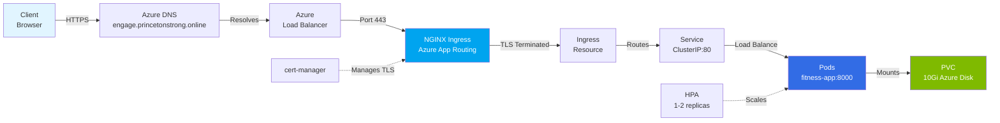

# Captain's Fitness Log

[](https://github.com/borninthedark/witness/actions/workflows/data.yml)
[](https://github.com/borninthedark/witness/actions/workflows/riker.yml)
[](https://github.com/borninthedark/witness/actions/workflows/worf.yml)
[](https://azure.microsoft.com/en-us/products/container-apps)
[](https://kubernetes.io/)
[](https://github.com/pre-commit/pre-commit)
[](tests/README.md)

**Status Report:** A production-ready FastAPI application serving as a professional resume and certification verification platform.

## 📑 Table of Contents

- [Overview](#overview)
- [Technology Stack](#technology-stack)
- [Quickstart](#quickstart)
- [Features](#features)
- [Architecture](#architecture)
- [Configuration](#configuration)
- [Deployment](#deployment)
  - [Container Deployment](#container-deployment)
  - [Kubernetes Deployment](#kubernetes-deployment)
  - [Azure Kubernetes Service (AKS)](#azure-kubernetes-service-aks)
- [Observability Guide](#observability-guide)
- [Development Workflow](#development-workflow)
- [Infrastructure as Code](#infrastructure-as-code)
- [Security Considerations](#security-considerations)
- [Documentation](#-documentation)

---

## Overview

Captain's Fitness Log (aka "Witness") is an enterprise-grade web application that combines professional credential management with a unique Star Trek aesthetic. Built with modern Python web technologies, it serves as both a digital portfolio and a cryptographic verification system for professional certifications.

**Key Capabilities:**
- **Digital Resume/CV Hosting** - Dynamic PDF generation from YAML data using ReportLab
- **Certification Verification** - SHA-256 hash validation with QR codes for authenticity
- **Contact Portal** - reCAPTCHA v2 and Formspree-protected contact form with LCARS theming
- **Professional Portfolio** - Showcase of credentials with Credly badge integration

### 📊 Project Stats

- **Test Coverage:** 62.77% (35+ tests, targeting 80%+)
- **Python Version:** 3.12+ (targeting 3.13)
- **Code Quality:** Black, Ruff, MyPy, Bandit, Pylint
- **Security:** Trivy scanning, CSRF protection, rate limiting
- **Deployment:** Docker, Kubernetes, Azure AKS
- **CI/CD:** GitHub Actions with automated testing and security scans

### Quick Facts

- **Header tagline:** "Status Report"
- **Default résumé PDF theme:** accent `#2C2F33`, page `#F4F2ED`
- **Admin authentication:** HTTP Basic (env-driven) as MVP; designed for FastAPI-Users migration

## Technology Stack

### Core Framework

- **FastAPI** (v0.115.4) - Modern async Python web framework
- **Python 3.12+** (target: 3.13) - Primary language with type hints
- **Uvicorn/Gunicorn** - ASGI server for production deployment

### Database & ORM

- **SQLAlchemy 2.0** - Modern ORM with async support and `Mapped[]` annotations
- **SQLite** - File-based database for local and production use
- **Alembic** - Database migration management
- **aiosqlite** - Async SQLite support

### Frontend & Templating

- **Jinja2** - Server-side HTML templating
- **HTMX** - Dynamic HTML interactions without heavy JavaScript
- **SCSS/LibSass** - CSS preprocessing for maintainable styles
- **Tailwind CSS** (CDN) - Utility-first CSS framework
- **Custom LCARS Design System** - Star Trek-inspired UI components

### Security

- **fastapi-users** - User authentication/authorization framework
- **passlib[bcrypt]** - Secure password hashing
- **itsdangerous** - Cryptographically signed token generation
- **Google reCAPTCHA v2** - CAPTCHA verification (via Formspree)
- **slowapi** - Rate limiting middleware
- **CSRF protection** - Custom double-submit cookie implementation

### Document Generation

- **ReportLab** - Professional PDF generation for resumes
- **PyYAML** - Structured resume data storage
- **qrcode[pil]** - QR code generation for certificate verification
- **Pillow** - Image processing and manipulation

### Observability

- **prometheus-client** - Metrics collection and exposure
- **python-json-logger** - Structured JSON logging
- **asgi-correlation-id** - Request tracking across services
- **OpenTelemetry** (optional) - Distributed tracing support

### Cloud/Azure Integration

- **Azure AKS** - Kubernetes runtime for production deployments

### Development Tools

- **pytest** - Testing framework
- **black** - Code formatting
- **ruff** - Fast Python linter
- **mypy** - Static type checking
- **bandit** - Security vulnerability scanning
- **pre-commit** - Git hooks automation
- **pylint** - Code quality analysis

## Quickstart

```bash
cd fitness
python -m venv .venv && source .venv/bin/activate
pip install -r requirements.txt
pre-commit install  # enables lint/tests/report hooks locally
cp .env.example .env  # configure ADMIN_PASSWORD and DATABASE_URL
podman-compose up -d  # starts Caddy + app locally
```

**Open:** [http://127.0.0.1:8000](http://127.0.0.1:8000)

Local development uses SQLite by default. The `.env.example` file sets a local `DATABASE_URL` so Alembic migrations and the running container share the same database file.

## Features

### 1. Resume/CV System

- **Dynamic PDF Generation** - Generated from `fitness/data/resume-data.yaml` using ReportLab
- **LCARS-themed Design** - Customizable accent colors and page styling
- **Contact Integration** - Embedded website links and professional information
- **Flexible Viewing** - Downloadable or inline browser viewing
- **Efficient Caching** - ETag and Last-Modified headers for bandwidth optimization
- **Content Separation** - YAML content decoupled from PDF presentation logic

### 2. Certification Verification

- **Auto-seeding** - Scans `fitness/static/certs/` for PDFs on startup
- **SHA-256 Validation** - Cryptographic hash ensures document authenticity
- **QR Code Generation** - Links to verification pages (`/v/{slug}`)
- **Multi-provider Support** - Linux Foundation, AWS, Azure, HashiCorp, Google, and more
- **Credly Integration** - Embedded badge iframes with customizable dimensions
- **DNS TXT Validation** - Optional additional verification layer
- **Lifecycle Management** - Tracks inactive/expired certifications
- **Metadata as Code** - Centralized configuration in `constants.py`

### 3. Contact Form

- **LCARS-styled UI** - Star Trek Enterprise computer terminal aesthetics
- **reCAPTCHA v2** - Integration via Formspree for spam prevention
- **Honeypot Protection** - Additional spam filtering layer
- **CSRF Validation** - Double-submit cookie protection
- **Rate Limiting** - 5 requests/minute for submissions, 10/minute for page views
- **Persistent Storage** - JSONL log of all submissions
- **Email Delivery** - Optional SMTP integration
- **Background Processing** - Async task handling for email sends

### 4. Security Features

- **Content Security Policy (CSP)** - Strict/transitional modes with nonce support
- **HSTS Headers** - HTTP Strict Transport Security enforcement
- **Rate Limiting** - Endpoint-specific throttling via slowapi
- **CSRF Protection** - All state-changing operations protected
- **Security Headers** - COOP, CORP, Permissions-Policy
- **WAF-ready** - Works with Caddy and Cloudflare WAF
- **Automated Scanning** - Bandit and Trivy in pre-commit hooks

### 5. Observability

- **Prometheus Metrics** - `/metrics` endpoint with request counters and latency histograms
- **Structured Logging** - JSON logs with correlation IDs
- **Health Checks** - `/healthz` (liveness) and `/readyz` (readiness with DB check)
- **Distributed Tracing** - Optional OpenTelemetry for FastAPI, SQLAlchemy, and HTTPX
- **Request Context** - Detailed error logging with full request information

## Architecture

### Application Flow

```text
┌──────────────────────────────────────────┐
│      Reverse Proxy (Caddy)              │
│   TLS Termination, Buffering, Caching   │
└──────────────────┬───────────────────────┘
                   │
┌──────────────────▼───────────────────────┐
│        FastAPI Application               │
│         (fitness/main.py)                │
├──────────────────────────────────────────┤
│  Middleware Stack (ordered):             │
│  1. GZipMiddleware                       │
│  2. SlowAPIMiddleware (rate limiting)    │
│  3. MetricsMiddleware (Prometheus)       │
│  4. SecurityHeadersMiddleware (CSP/HSTS) │
│  5. CorrelationIdMiddleware              │
│  6. CORSMiddleware                       │
└──────────────────┬───────────────────────┘
                   │
      ┌────────────┼────────────┐
      │            │            │
┌─────▼───┐  ┌────▼────┐  ┌────▼─────┐
│UI Router│  │API Router│  │Admin Router│
│(Jinja2) │  │  (JSON) │  │(protected) │
└─────┬───┘  └────┬────┘  └────┬─────┘
      │           │            │
      └───────────┼────────────┘
                  │
          ┌───────▼────────┐
          │   Services     │
          │ - PDF Resume   │
          │ - Storage      │
          │ - Mailer       │
          └───────┬────────┘
                  │
          ┌───────▼────────┐
          │ Database (ORM) │
          │  SQLAlchemy    │
          └───────┬────────┘
                  │
          ┌───────▼───────┐
          │    SQLite     │
          │  fitness.db   │
          └───────────────┘
```

### Notable Design Patterns

#### 1. SQLite Database Strategy

`config.py` resolves a single SQLite URL:

1. `DATABASE_URL` if provided
2. Default `sqlite:///./data/fitness.db`

This keeps local and production deployments consistent and file-backed.

#### 2. Certification Metadata as Code

`constants.py` serves as the single source of truth for all certification metadata:
- Display names and issuers
- Verification URLs
- Credly badge IDs and iframe dimensions
- Provider-specific verification methods
- Inactive certification tracking

This eliminates database drift and makes metadata version-controlled.

#### 3. Star Trek LCARS Design System

- Custom SCSS with LCARS color palette
- Left accent stripe on resume PDFs
- Contact form styled like Enterprise computer terminals
- Font choices and spacing mirror the aesthetic
- Assets organized in `fitness/static/lcars/`

#### 4. Static Asset Fingerprinting

```python
asset_url()  # Returns: /static/styles.css?v=1699847623
```

Enables aggressive browser caching with automatic cache busting on file updates.

#### 5. Resume Generation from YAML

Separation of content from presentation:
- **Data:** `fitness/data/resume-data.yaml` (human-editable)
- **Logic:** `fitness/services/pdf_resume.py` (ReportLab engine)
- **Styling:** Configurable accent/page colors via parameters

## Configuration

### Environment Variables

Create a `.env` file with these key settings:

```bash
# Application
SECRET_KEY=your-secret-key-here
ADMIN_PASSWORD=your-admin-password
ENVIRONMENT=development  # or production
CSRF_SECRET=another-secret-key

# Database (SQLite only)
DATABASE_URL=sqlite:///./data/fitness.db

# Observability
LOG_LEVEL=INFO
ENABLE_TRACING=false
OTLP_ENDPOINT=https://otel-collector:4318/v1/traces

# Contact Form (optional SMTP)
SMTP_HOST=smtp.gmail.com
SMTP_PORT=587
SMTP_STARTTLS=true
SMTP_USER=your-email@gmail.com
SMTP_PASS=your-app-password
MAIL_FROM=your-email@gmail.com
MAIL_TO=destination@example.com

# Feature Flags
ENABLE_REPORTS_DASHBOARD=false
```

### Static Assets & Caching

- **CSS/JS Fingerprinting:** `asset_url()` appends modification timestamps
- **Immutable Headers:** Static files served with `Cache-Control: public, max-age=31536000, immutable`
- **PDF Optimization:** Resume PDF includes `ETag` and `Last-Modified` for conditional GETs
- **CDN-ready:** Works seamlessly with Cloudflare or Azure CDN

## Deployment

### Manual Deployment

Follow FastAPI's [server machine guidance](https://fastapi.tiangolo.com/deployment/manually/#server-machine-and-server-program) and run behind Gunicorn with Uvicorn workers:

```bash
WEB_WORKERS=$(nproc) gunicorn -c gunicorn.conf.py fitness.main:app
```

**Best practices:**
- Drop `--reload` in production
- Size workers based on CPU cores (2-4× core count)
- Keep Gunicorn behind a reverse proxy (Caddy/Nginx) for TLS termination and buffering

### Container Deployment

The `Containerfile` follows FastAPI's [Docker deployment recommendations](https://fastapi.tiangolo.com/deployment/docker/):

**Build:**
```bash
# Docker
docker build -t fitness:latest -f Containerfile .

# Podman (preserves health checks)
podman build --format docker -t fitness:latest -f Containerfile .
```

**Run with Compose:**
```bash
cp .env.example .env
podman-compose up -d
```

The compose stack includes:
- FastAPI application
- Caddy reverse proxy with automatic HTTPS (local development)

**Local Development Architecture:**
```text
Client → Caddy (TLS, reverse proxy) → FastAPI App → SQLite
         :80/:443                      :8000          :5432
```

*Note: Production AKS uses Azure-managed NGINX ingress instead of Caddy. See [AKS Network Architecture](docs/aks-network-architecture.md).*

**Container Features:**
- Multi-stage Python 3.12-slim base
- Non-root `app` user for security
- Health check on `/healthz`
- Entrypoint script handles database migrations

Set `SKIP_DB_MIGRATIONS=1` to bypass Alembic migrations in ephemeral environments.

### Kubernetes Deployment

**Simple Deployment:**
```bash
kubectl apply -f deploy/k8s/deploy.yaml
kubectl apply -f deploy/k8s/lets-encrypt-issuer.yaml
```

**Features:**
- Persistent volume for SQLite/data
- Let's Encrypt TLS via cert-manager
- Namespace isolation (`fitness`)
- GHCR image pull secrets (configure with your GitHub PAT)
- Horizontal Pod Autoscaler (CPU/memory based)
- Azure App Routing ingress controller support

### Azure Kubernetes Service (AKS)

#### Network Architecture

The application runs on AKS with Azure-managed NGINX ingress and automatic TLS via cert-manager:



**See [docs/aks-network-architecture.md](docs/aks-network-architecture.md) for the complete network architecture diagram with traffic flows, security boundaries, and troubleshooting guide.**

#### Infrastructure Provisioning (Bicep)

Bicep templates provision the Azure infrastructure:

```bash
# Deploy AKS cluster and supporting resources
az deployment sub create \
  --location eastus \
  --template-file deploy/azure/bicep/AKS/main.bicep \
  --parameters @deploy/azure/bicep/AKS/parameters.production.bicepparam

# Get credentials
az aks get-credentials --resource-group utopia-rg --name fitness-aks
```

**Bicep provisions:**
- AKS cluster with auto-scaling node pools (1-5 nodes, Standard_D2s_v3)
- Log Analytics workspace for monitoring
- Azure App Routing add-on (managed NGINX ingress + cert-manager)
- System-assigned managed identities
- Azure RBAC enabled
- Locked-down security configuration

#### Application Deployment

After infrastructure is ready, deploy the application:

```bash
# Apply Let's Encrypt cluster issuer (one-time)
kubectl apply -f deploy/k8s/lets-encrypt-issuer.yaml

# Deploy application
kubectl apply -f deploy/k8s/deploy.yaml
```

**Application deployment creates:**
- Namespace, secrets, and persistent storage
- Deployment with health probes and security context
- Service and Ingress (uses Azure App Routing)
- HorizontalPodAutoscaler for auto-scaling

#### Infrastructure Alignment

The Bicep-provisioned infrastructure integrates with Kubernetes manifests:

| Component | Bicep Provisions | Kubernetes Uses |
|-----------|------------------|-----------------|
| Ingress | Azure App Routing add-on | `ingressClassName: webapprouting.kubernetes.azure.com` |
| cert-manager | Installed via App Routing | `cert-manager.io/cluster-issuer: letsencrypt-prod` |
| Storage | Managed Disks (default StorageClass) | `storageClassName: managed-csi` |
| Monitoring | Log Analytics workspace | Container logs auto-collected |
| Identity | System-assigned managed identity | Can access Azure resources |

### GitHub Actions CI/CD

The CI/CD pipeline uses Star Trek TNG-themed workflow names:

**Application Workflows:**

| Workflow | File | Purpose |
|----------|------|---------|
| **Data - CI** | `data.yml` | Build, test, scan, push container images to GHCR |
| **Riker - Release** | `riker.yml` | Semantic versioning, GitHub releases, production tags |
| **Troi - Docs** | `troi.yml` | Coverage badges, security reports, doc validation |

**Data - CI** (`data.yml`):
- Container image building with Buildah (OCI format)
- Python linting (Ruff, MyPy) and testing (pytest)
- Security scanning with Trivy
- Image signing with Cosign (Sigstore keyless OIDC)
- Pushes `dev` and `sha-*` tags to GHCR

**Riker - Release** (`riker.yml`):
- Triggered automatically after successful Data CI or manually
- Semantic versioning via conventional commits:
  - `feat:` -> minor bump (0.X.0)
  - `fix:` -> patch bump (0.0.X)
  - `feat!:` or `BREAKING CHANGE:` -> major bump (X.0.0)
- Creates GitHub releases with changelogs
- Pushes `latest`, `prod`, and versioned tags to GHCR
- Image signing with Cosign

**Infrastructure Workflows (Terraform):**

| Workflow | File | Purpose |
|----------|------|---------|
| **Picard - Plan** | `picard.yml` | Terraform plan, validation, PR comments |
| **La Forge - Apply** | `laforge.yml` | Terraform apply (after plan approval) |
| **Worf - Security** | `worf.yml` | Checkov, tfsec, Trivy security scans |
| **Tasha - Destroy** | `tasha.yml` | Terraform destroy (manual, protected) |

See `.github/workflows/` for workflow definitions.

## Observability Guide

### Azure Monitor Integration (Production)

**For AKS deployments**, the application integrates with Azure Monitor's managed observability stack:

- **Azure Monitor Managed Prometheus** - Automatic scraping of application metrics
- **Azure Managed Grafana** - Pre-built dashboards for cluster, workload, and application monitoring
- **Container Insights** - Centralized log collection with 30-day retention

**Key Features:**
- Unified dashboards combining metrics and logs
- PromQL and KQL query support
- Automatic alerting on critical metrics
- No Prometheus infrastructure to maintain

See [AKS Network Architecture - Monitoring & Observability](docs/aks-network-architecture.md#monitoring--observability) for complete details.

### Logging

Structured JSON logs with correlation IDs:

```json
{
  "timestamp": "2024-01-15T10:30:45Z",
  "level": "INFO",
  "correlation_id": "abc123def456",
  "message": "Request processed successfully",
  "path": "/certs",
  "method": "GET",
  "status_code": 200,
  "duration_ms": 42.5
}
```

**Local Development:** Configure via `LOG_LEVEL` environment variable (DEBUG, INFO, WARNING, ERROR, CRITICAL).

**AKS Production:** Logs automatically collected by Container Insights and forwarded to Log Analytics workspace.

### Metrics

Prometheus-compatible metrics on `/metrics` endpoint:

```python
# Request counters
http_requests_total{method="GET",path="/certs",status="200"} 1547

# Latency histograms
http_request_duration_seconds_bucket{method="GET",path="/certs",le="0.5"} 1420
http_request_duration_seconds_bucket{method="GET",path="/certs",le="1.0"} 1545
http_request_duration_seconds_sum{method="GET",path="/certs"} 245.67
http_request_duration_seconds_count{method="GET",path="/certs"} 1547
```

**Security:** The `/metrics` endpoint is protected with HTTP Basic Auth (see `fitness/config.py` for `METRICS_USERNAME` and `METRICS_PASSWORD` configuration).

**AKS Production:** Automatically scraped by Azure Monitor Managed Prometheus and visualized in Grafana dashboards.

**Local Development:** Access manually at `http://localhost:8000/metrics` with credentials.

### Health Checks

**Liveness:** `/healthz` - Returns 200 if application is running

**Readiness:** `/readyz` - Returns 200 if application can serve traffic (checks DB connectivity and filesystem)

### Distributed Tracing

Enable OpenTelemetry tracing:

```bash
ENABLE_TRACING=true
OTLP_ENDPOINT=https://otel-collector:4318/v1/traces
OTLP_HEADERS=api-key=your-key,another-header=value
```

Instruments:
- FastAPI request/response
- SQLAlchemy database queries
- HTTPX external HTTP calls

## Development Workflow

### Pre-commit Hooks

Install hooks:
```bash
pip install pre-commit && pre-commit install
```

**Automated checks on every commit:**
- **Formatting:** black, isort
- **Linting:** ruff, flake8, pylint, mypy
- **Security:** bandit (code), trivy (dependencies/containers)
- **Validation:** yamllint, jsonlint, shellcheck, markdownlint
- **Reports:** Automated security report generation

**Optional hooks:**
```bash
pre-commit install --hook-type commit-msg
pre-commit install --hook-type pre-push
```

**Update hook versions:**
```bash
pre-commit autoupdate
```

**Hermetic execution:**
```bash
python scripts/run-precommit-podman.py
```

Builds a Podman image with all tools and runs hooks in isolation.

All logs written to `.precommit_logs/` (gitignored).

### Testing

**Current Coverage:** 62.77% (35+ tests, targeting 80%+)

Run the test suite:
```bash
pytest                        # Run all tests with coverage
pytest -v                     # Verbose output
pytest -n auto                # Parallel execution (faster)
pytest --cov-report=html      # Generate HTML coverage report
```

**Test Organization:**
- `tests/security/` - CSRF and security tests (100% coverage)
- `tests/routers/` - UI endpoint tests
- `tests/test_integration.py` - End-to-end integration tests
- `tests/test_smoke.py` - Quick smoke tests
- `tests/test_constants.py` - Certification metadata tests

**See [tests/README.md](tests/README.md) for comprehensive test documentation, coverage goals, and writing new tests.**

### Code Quality

**Recommended: Use pre-commit hooks** (runs all checks automatically)

```bash
# Run all quality checks
pre-commit run --all-files

# Run on staged files only (faster)
pre-commit run

# Run specific hook
pre-commit run black
pre-commit run mypy
```

Pre-commit hooks automatically run on every commit and include:
- **Formatting:** black, isort
- **Linting:** ruff, flake8, pylint
- **Type checking:** mypy
- **Security:** bandit, trivy
- **Validation:** yamllint, shellcheck, markdownlint

**Manual commands** (for CI, troubleshooting, or specific files):

```bash
# Format code
black fitness/ tests/
isort fitness/ tests/

# Type checking
mypy fitness/

# Security scans
bandit -r fitness/ tests/ -ll
trivy fs --severity HIGH,CRITICAL .

# Lint specific file
ruff check fitness/main.py --fix
```

**Why use pre-commit?**
- ✅ Consistent with CI/CD checks
- ✅ Catches issues before commit
- ✅ Faster with caching
- ✅ Single source of truth

## Infrastructure as Code

**Primary IaC Method:** Azure Bicep

The project uses **Bicep** for infrastructure provisioning on Azure. Bicep templates are located in `deploy/azure/bicep/AKS/`.

### Bicep Modules

**Structure:**
```text
deploy/azure/bicep/AKS/
├── main.bicep                          # Main deployment template
├── modules/
│   ├── aks-cluster.bicep              # AKS cluster configuration
│   └── log-analytics.bicep            # Log Analytics workspace
└── parameters.production.bicepparam    # Production parameters
```

**Provisions:**
- AKS cluster with auto-scaling node pools (1-5 nodes, Standard_D2s_v3)
- Azure App Routing add-on (managed NGINX ingress controller + cert-manager)
- Log Analytics workspace for Azure Monitor integration
- System-assigned managed identities for secure Azure resource access
- Locked-down network security and RBAC configuration

**Deployment:**
```bash
# Deploy infrastructure
az deployment sub create \
  --location eastus \
  --template-file deploy/azure/bicep/AKS/main.bicep \
  --parameters @deploy/azure/bicep/AKS/parameters.production.bicepparam

# Get cluster credentials
az aks get-credentials --resource-group utopia-rg --name fitness-aks

# Deploy application manifests
kubectl apply -f deploy/k8s/lets-encrypt-issuer.yaml
kubectl apply -f deploy/k8s/deploy.yaml
```

**Security Best Practices:**
- ✅ All sensitive parameters marked `@secure()`
- ✅ No `listKeys()` in outputs
- ✅ Resource symbol references over `resourceId()`
- ✅ Managed identities for service authentication
- ✅ Secrets injected from GitHub Actions, never committed

**Monitoring Integration:**
- Azure Monitor Managed Prometheus automatically scrapes `/metrics` endpoint
- Azure Managed Grafana provides pre-built dashboards for cluster and application monitoring
- Container logs auto-collected to Log Analytics workspace

See [docs/deployment.md](docs/deployment.md) for detailed deployment guide.

## Security Considerations

### Known Vulnerabilities

**python-multipart CVE-2024-53981:**

`python-multipart` pinned to `0.0.7` due to `fastapi-users==12.1.3` requirement. CVE-2024-53981 is theoretically exploitable.

**Mitigations in place:**
- Rate limiting via slowapi (5 req/min on POST endpoints)
- WAF protection via Caddy reverse proxy
- reCAPTCHA v2 via Formspree on contact form
- Comprehensive request logging

**Action:** Upgrade to `python-multipart>=0.0.18` when fastapi-users relaxes constraints.

### Best Practices

- ✅ Never logs credentials or secrets
- ✅ All Bicep parameters marked `@secure()` where appropriate
- ✅ No secrets in Git history
- ✅ Regular Trivy and Bandit scans
- ✅ CSRF protection on all state-changing operations
- ✅ Rate limiting on sensitive endpoints
- ✅ Strict CSP with nonce support (optional)
- ✅ HSTS headers with preload directive

## 📚 Documentation

### Architecture
- **[Project Overview](docs/overview.md)** - Project structure, data sources, application flow.
- **[AKS Network Architecture](docs/aks-network-architecture.md)** - Network diagram, traffic flows, troubleshooting.

### Deployment
- **[Deployment Guide (Docker + Caddy)](docs/deployment.md)** - Container, Compose, AKS, systemd deployment.

### Operations
- **[Tooling & Workflows](docs/tooling.md)** - Testing, linting, pre-commit workflows.
- **[Admin User Setup](docs/admin-setup.md)** - Admin authentication, user management.
- **[Status Dashboard Setup Guide](docs/status-dashboard-setup.md)** - Prometheus, Grafana, public status page.

### Features
- **[Certification Management & SHA-256 Verification](docs/certification-management.md)** - SHA-256 verification, status/visibility controls.

### Application Documentation
- **[Test Suite Guide](tests/README.md)** - Test structure, coverage, writing tests.

## License

See LICENSE file for details.
