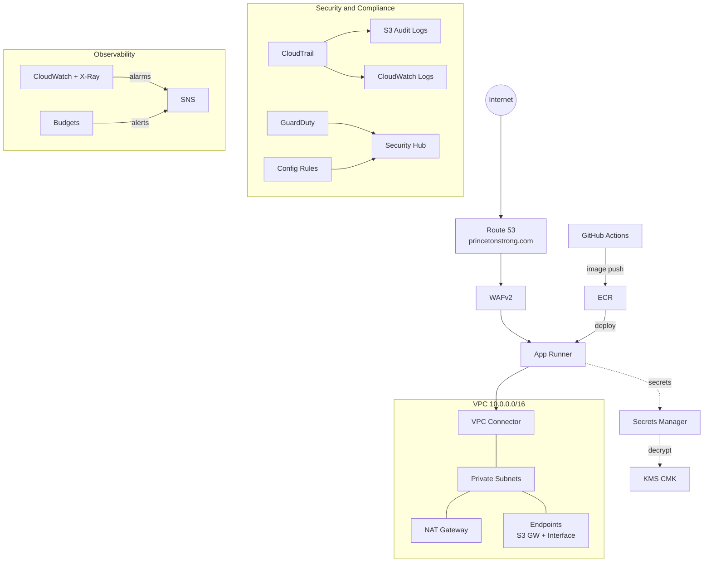
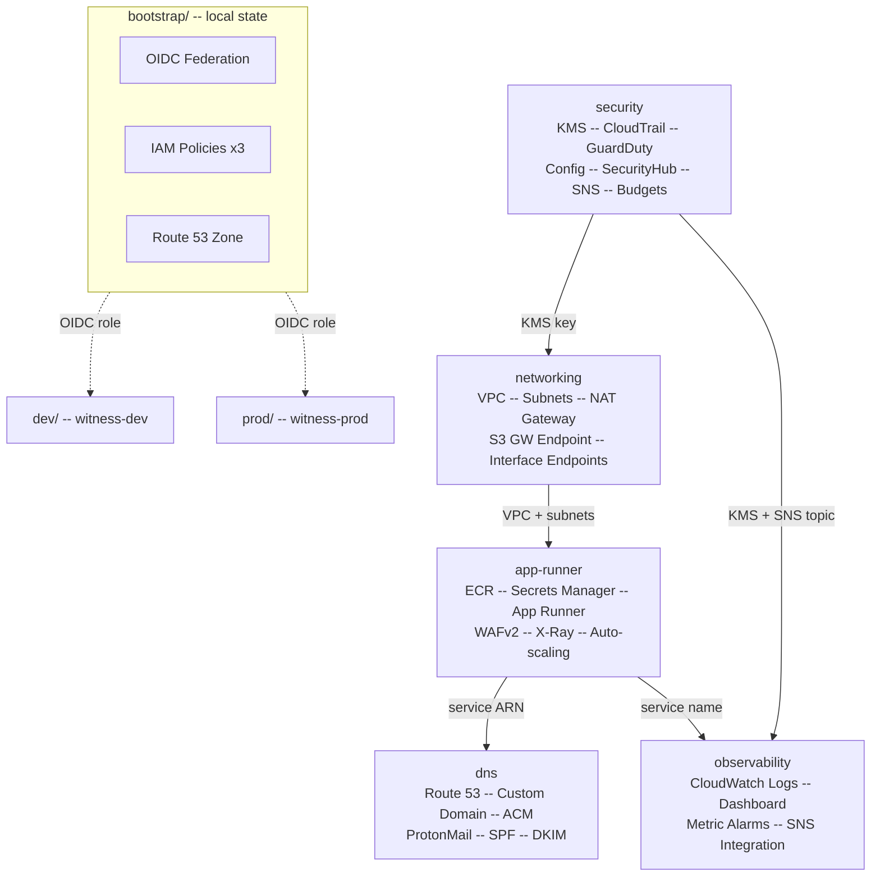
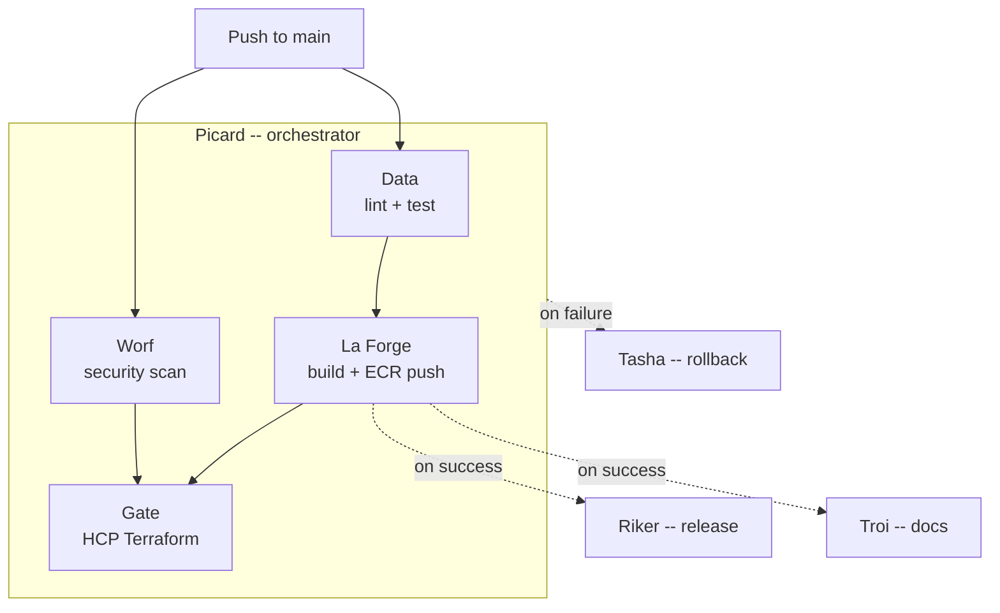

# Witness - The Captain's Fitness Log

[](https://www.python.org/)
[](tests/README.md)
[](https://aws.amazon.com/apprunner/)
[](https://app.terraform.io/)
[](https://github.com/pre-commit/pre-commit)

A production FastAPI application deployed on AWS App Runner, serving as a professional resume
and certification verification platform with a Star Trek LCARS-inspired interface. Infrastructure
is fully managed through Terraform on HCP Terraform with VCS-driven workflows.

---

- **[Overview](#overview)** &#8226; **[Tech Stack](#technology-stack)** &#8226; **[Architecture](#aws-architecture)** &#8226; **[Terraform](#terraform-structure)** &#8226; **[CI/CD](#cicd-pipelines)** &#8226; **[Features](#features)**
  - [AWS Services](#aws-services-used) &#8226; [Well-Architected](#well-architected-alignment) &#8226; [Workflow Reference](#workflow-reference)
- **[Quickstart](#quickstart)** &#8226; **[Config](#configuration)** &#8226; **[Development](#development)** &#8226; **[Observability](#observability)** &#8226; **[Security](#security)**
  - [Container Build](#container-build) &#8226; [Package Management](#package-management) &#8226; [Pre-commit Hooks](#pre-commit-hooks) &#8226; [Testing](#testing)
- **[Documentation](#documentation)** &#8226; **[AI-Assisted Dev](#ai-assisted-development)** &#8226; **[License](#license)**
  - [MCP Servers](#mcp-servers)

---

## Overview

Witness is an enterprise-grade web application that combines professional credential management
with a Star Trek LCARS aesthetic. It is deployed to AWS App Runner behind WAFv2 with Route 53
custom domains, CloudTrail audit logging, GuardDuty threat detection, and Config compliance rules.

> **Migration note:** This application was originally deployed on Azure Kubernetes Service (AKS)
> with Azure Bicep IaC. It has since been fully migrated to AWS App Runner with Terraform,
> including networking, security, observability, and CI/CD.

**Capabilities:**

- **Digital Resume** -- PDF generated at container build time from YAML data via ReportLab
- **Certification Verification** -- SHA-256 hash validation with QR codes
- **Contact Portal** -- reCAPTCHA v2 + Formspree, honeypot, CSRF double-submit cookie
- **Security Posture** -- WAFv2, GuardDuty, Security Hub, Config rules, X-Ray tracing

## Technology Stack

| Layer | Technology |
|-------|-----------|
| **Runtime** | Python 3.12, FastAPI 0.115.4, Uvicorn |
| **Database** | SQLAlchemy 2.0, SQLite, Alembic |
| **Frontend** | Jinja2, HTMX, Tailwind CSS (CDN), LCARS design system |
| **PDF** | ReportLab, PyYAML (resume-data.yaml) |
| **Observability** | Prometheus, OpenTelemetry, CloudWatch, X-Ray |
| **Security** | slowapi, CSRF, CSP/HSTS, Bandit, Trivy, Checkov |
| **Packaging** | [uv](https://docs.astral.sh/uv/) (lockfile), setuptools build backend |
| **Container** | Python 3.12-slim, multi-stage uv install, non-root user |
| **Cloud** | AWS App Runner, ECR, VPC, Route 53, WAFv2, KMS, Secrets Manager |
| **IaC** | Terraform with HCP Terraform (VCS-driven), Checkov + tfsec |

## AWS Architecture



See [docs/architecture.md](docs/architecture.md) for the full diagram and traffic flows.

### AWS Services Used

| Service | Purpose | AWS Docs |
|---------|---------|----------|
| [App Runner](https://docs.aws.amazon.com/apprunner/) | Container hosting with auto-scaling | [Developer Guide](https://docs.aws.amazon.com/apprunner/latest/dg/) |
| [ECR](https://docs.aws.amazon.com/ecr/) | Container image registry | [User Guide](https://docs.aws.amazon.com/AmazonECR/latest/userguide/) |
| [VPC](https://docs.aws.amazon.com/vpc/) | Network isolation, private subnets, NAT | [User Guide](https://docs.aws.amazon.com/vpc/latest/userguide/) |
| [Route 53](https://docs.aws.amazon.com/route53/) | DNS, custom domain, health checks | [Developer Guide](https://docs.aws.amazon.com/Route53/latest/DeveloperGuide/) |
| [WAFv2](https://docs.aws.amazon.com/waf/) | Web application firewall (3 rule groups) | [Developer Guide](https://docs.aws.amazon.com/waf/latest/developerguide/) |
| [KMS](https://docs.aws.amazon.com/kms/) | Customer-managed encryption keys | [Developer Guide](https://docs.aws.amazon.com/kms/latest/developerguide/) |
| [Secrets Manager](https://docs.aws.amazon.com/secretsmanager/) | Application secrets injection | [User Guide](https://docs.aws.amazon.com/secretsmanager/latest/userguide/) |
| [CloudTrail](https://docs.aws.amazon.com/cloudtrail/) | API audit logging | [User Guide](https://docs.aws.amazon.com/awscloudtrail/latest/userguide/) |
| [GuardDuty](https://docs.aws.amazon.com/guardduty/) | Threat detection | [User Guide](https://docs.aws.amazon.com/guardduty/latest/ug/) |
| [Security Hub](https://docs.aws.amazon.com/securityhub/) | Security posture (prod) | [User Guide](https://docs.aws.amazon.com/securityhub/latest/userguide/) |
| [Config](https://docs.aws.amazon.com/config/) | Compliance rules | [Developer Guide](https://docs.aws.amazon.com/config/latest/developerguide/) |
| [CloudWatch](https://docs.aws.amazon.com/cloudwatch/) | Logs, metrics, dashboards, alarms | [User Guide](https://docs.aws.amazon.com/AmazonCloudWatch/latest/monitoring/) |
| [X-Ray](https://docs.aws.amazon.com/xray/) | Distributed tracing | [Developer Guide](https://docs.aws.amazon.com/xray/latest/devguide/) |
| [SNS](https://docs.aws.amazon.com/sns/) | Alarm notifications, budget alerts | [Developer Guide](https://docs.aws.amazon.com/sns/latest/dg/) |
| [Budgets](https://docs.aws.amazon.com/cost-management/latest/userguide/budgets-managing-costs.html) | Cost alerts | [User Guide](https://docs.aws.amazon.com/cost-management/latest/userguide/) |
| [S3](https://docs.aws.amazon.com/s3/) | CloudTrail logs, pipeline artifacts | [User Guide](https://docs.aws.amazon.com/AmazonS3/latest/userguide/) |

## Terraform Structure

Infrastructure is organized into reusable modules with separate dev and prod root configurations,
managed by [HCP Terraform](https://app.terraform.io/) (org: `DefiantEmissary`).



| Module | Key Resources |
|--------|--------------|
| **networking** | VPC (3 AZ), public/private subnets, NAT Gateway, S3 gateway endpoint, interface endpoints (prod) |
| **security** | KMS CMK, CloudTrail, Config + managed rules, GuardDuty, Security Hub (prod), SNS alarm topic, budget alerts |
| **app-runner** | ECR repo, Secrets Manager, App Runner service + VPC connector, WAFv2 (3 rule groups), X-Ray group |
| **dns** | Route 53 A/CNAME/TXT/MX records, App Runner custom domain + ACM validation, ProtonMail SPF/DKIM/MX |
| **observability** | CloudWatch log groups, metric alarms (5xx, latency, CPU), dashboard, SNS integration |

### Well-Architected Alignment

The infrastructure follows [AWS Well-Architected Framework](https://docs.aws.amazon.com/wellarchitected/latest/framework/) principles:

- **Security:** KMS encryption, least-privilege IAM, WAFv2, GuardDuty, Security Hub, CloudTrail
- **Reliability:** Multi-AZ VPC, App Runner auto-scaling, health checks, auto-rollback
- **Cost Optimization:** Budget alerts, VPC interface endpoints only in prod, S3 gateway endpoint
- **Operational Excellence:** SNS alarm routing, CloudWatch dashboards, X-Ray tracing
- **Performance:** App Runner auto-scaling, CloudWatch latency alarms

## CI/CD Pipelines

All workflows use Star Trek TNG-themed names and run on GitHub Actions.

### Pipeline Flow



### Workflow Reference

| Workflow | File | Role | Trigger |
|----------|------|------|---------|
| **Picard** | `picard.yml` | CI/CD orchestrator | Push to main |
| **Data** | `data.yml` | Lint, test, validate | Called by Picard / PR |
| **Worf** | `worf.yml` | Checkov, tfsec, Trivy | Called by Picard |
| **La Forge** | `laforge.yml` | Container build, ECR push, Cosign | Called by Picard + schedule |
| **Riker** | `riker.yml` | Semver release, GHCR retag | After La Forge / manual |
| **Crusher** | `crusher.yml` | Health checks (App Runner + pipelines) | Manual |
| **Tasha** | `tasha.yml` | Auto-rollback on failed applies | workflow_run + schedule |
| **Troi** | `troi.yml` | Coverage badges, security reports | After La Forge / schedule / manual |

## Features

### Resume/CV System

- PDF generated at container build time from `fitness/data/resume-data.yaml`
- LCARS-themed design with configurable accent colors
- ETag and Last-Modified headers for caching
- Downloadable or inline browser viewing

### Certification Verification

- Auto-seeds from `fitness/static/certs/` on startup
- SHA-256 hash validation with QR codes at `/v/{slug}`
- Supports Linux Foundation, AWS, Azure, HashiCorp, Google
- Credly badge integration with embedded iframes
- Metadata as code in `constants.py`

### Contact Form

- reCAPTCHA v2 via Formspree + honeypot field
- CSRF double-submit cookie protection
- Rate limiting (5 req/min submissions, 10/min views)
- Optional SMTP email delivery with async processing

### Security Posture

- WAFv2 with 3 rule groups (rate limit, managed rules, IP reputation)
- CSP headers with nonce support, HSTS, COOP, CORP
- Endpoint-specific rate limiting via slowapi
- Bandit, Trivy, Checkov, tfsec scanning in CI

## Quickstart

```bash
# Clone and install
git clone https://github.com/borninthedark/witness.git
cd witness
uv sync                        # install all dependencies
pre-commit install             # enable local hooks

# Configure
cp .env.example .env           # edit with your secrets

# Run locally
uv run uvicorn fitness.main:app --reload --port 8000
```

Open `http://localhost:8000`

### Container Build

```bash
# Podman (preserves health checks)
podman build --format docker -t witness:latest -f container/Containerfile .
podman run -p 8000:8000 --env-file .env witness:latest
```

## Configuration

Key environment variables (see [docs/variables.md](docs/variables.md) for full reference):

| Variable | Purpose |
|----------|---------|
| `SECRET_KEY` | Application signing key |
| `ADMIN_PASSWORD` | Admin authentication |
| `DATABASE_URL` | SQLite path (default: `sqlite:///./data/fitness.db`) |
| `ENVIRONMENT` | `development` or `production` |
| `ENABLE_TRACING` | OpenTelemetry X-Ray tracing |
| `FORMSPREE_ID` | Contact form endpoint |

## Development

### Package Management

This project uses [uv](https://docs.astral.sh/uv/) for dependency management:

- `pyproject.toml` defines `[project]` dependencies + `[dependency-groups]` for dev/security
- `uv.lock` provides deterministic resolution
- `uv sync --frozen` in CI, `uv run` for script execution
- Container builds use `COPY --from=ghcr.io/astral-sh/uv:latest`

### Pre-commit Hooks

```bash
uv run pre-commit install
uv run pre-commit run --all-files
```

Hooks include: black, isort, flake8, pylint, mypy, bandit, yamllint, shellcheck,
markdownlint, terraform_fmt, terraform_validate, tflint, DRY enforcement, and README generation.

### Testing

```bash
uv run pytest                  # full suite with coverage
uv run pytest -n auto          # parallel execution
uv run pytest --cov-report=html  # HTML coverage report
```

Test structure: `tests/security/`, `tests/routers/`, `tests/test_integration.py`, `tests/test_smoke.py`.

## Observability

| Signal | Endpoint / Service |
|--------|-------------------|
| **Health** | `/healthz` (liveness), `/readyz` (readiness + DB check) |
| **Metrics** | `/metrics` (Prometheus, Basic Auth protected) |
| **Logs** | Structured JSON with correlation IDs, forwarded to CloudWatch |
| **Traces** | OpenTelemetry SDK with X-Ray exporter (FastAPI, SQLAlchemy, HTTPX) |
| **Dashboards** | CloudWatch dashboards with 5xx, latency, CPU alarms |

## Security

- **Encryption:** KMS customer-managed keys for all at-rest encryption
- **Network:** Private subnets, VPC endpoints, NAT Gateway
- **WAF:** Rate limiting, AWS managed rule groups, IP reputation lists
- **Audit:** CloudTrail API logging, Config compliance rules
- **Detection:** GuardDuty threat detection, Security Hub (prod)
- **Supply Chain:** Cosign image signing, Trivy + Checkov scanning
- **Application:** CSRF, rate limiting, CSP/HSTS, honeypot, reCAPTCHA

## Documentation

| Document | Description |
|----------|-------------|
| [Architecture](docs/architecture.md) | AWS architecture diagram, traffic flows, module details |
| [Variables](docs/variables.md) | Full variable reference for bootstrap, workspaces, and GitHub Actions |
| [Certification Management](docs/certification-management.md) | SHA-256 verification, status/visibility controls |
| [Admin Setup](docs/admin-setup.md) | Admin authentication, user management |
| [Pre-commit Hooks](docs/pre-commit.md) | Hook reference, design decisions, shift-left strategy |
| [Test Suite](tests/README.md) | Test structure, coverage goals, writing new tests |

## AI-Assisted Development

This project was developed with assistance from [Claude Code](https://docs.anthropic.com/en/docs/claude-code) and [ChatGPT](https://chatgpt.com/).

### MCP Servers

Infrastructure development uses [Model Context Protocol](https://modelcontextprotocol.io/) servers
for Terraform registry lookups, provider documentation, and AWS workflow execution.

| Server | Purpose | Docs |
|--------|---------|------|
| [Terraform Registry MCP](https://github.com/hashicorp/terraform-mcp-server) | Module/provider search, version lookups, policy discovery | [README](https://github.com/hashicorp/terraform-mcp-server#readme) |
| [AWS Labs Terraform MCP](https://github.com/awslabs/mcp-server-terraform) | AWS provider docs, Checkov scans, terraform/terragrunt execution | [README](https://github.com/awslabs/mcp-server-terraform#readme) |

## License

See [LICENSE](LICENSE) file for details.
