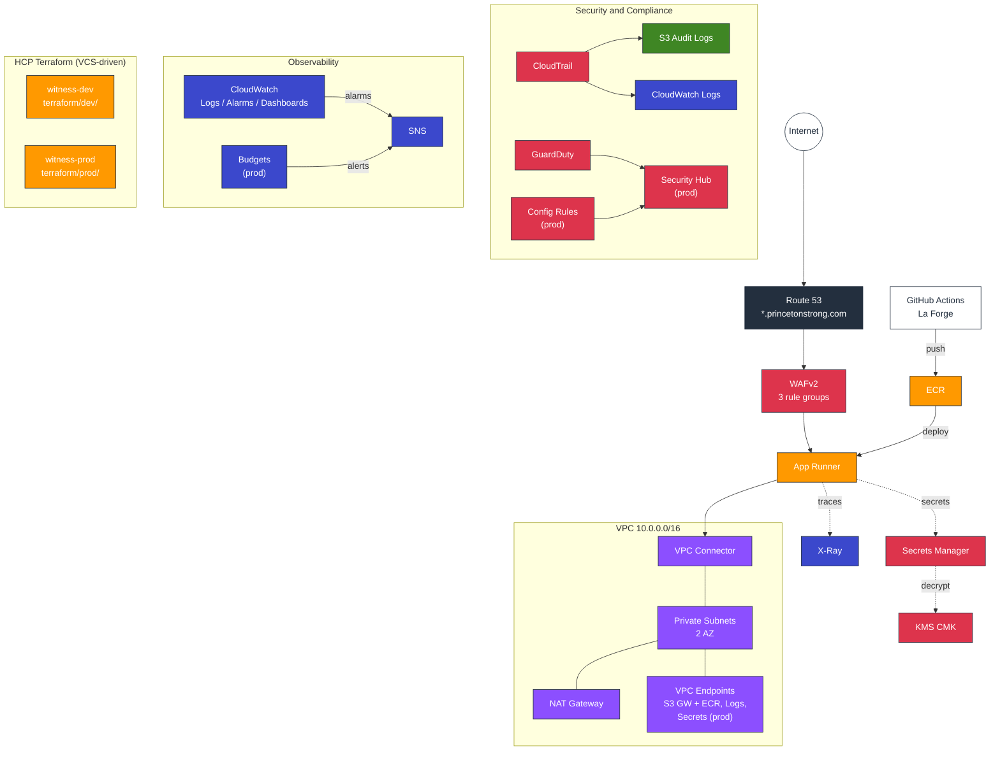
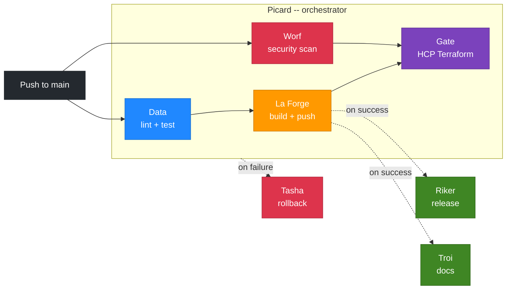

# Witness - AWS Architecture

## Overview

Witness is a FastAPI application deployed on AWS App Runner, managed entirely
through Terraform with HCP Terraform VCS-driven workflows. Infrastructure is
organized into reusable modules with separate dev and prod environments.

The architecture follows AWS Well-Architected Framework principles and
Landing Zone Accelerator patterns adapted for a single-account deployment.

## Architecture Diagram



## Directory Layout

```text
terraform/
├── bootstrap/             # OIDC provider, IAM roles (3 policies), Route 53 domain
├── modules/
│   ├── networking/        # VPC, subnets, NAT, IGW, VPC endpoints
│   ├── security/          # KMS, CloudTrail, Config, GuardDuty, Security Hub, SNS, Budgets
│   ├── app-runner/        # ECR, Secrets Manager, App Runner, WAFv2, X-Ray
│   ├── dns/               # Route 53 records, App Runner custom domain
│   ├── observability/     # CloudWatch log groups, dashboards, alarms
│   └── codepipeline/      # CodePipeline, CodeBuild, S3 artifacts
├── dev/                   # Dev workspace (HCP Terraform: witness-dev)
└── prod/                  # Prod workspace (HCP Terraform: witness-prod)
```

## Infrastructure Components

### Bootstrap (one-time, local apply)

The bootstrap configuration creates shared resources that both environments
depend on:

- **OIDC Identity Provider** for HCP Terraform dynamic provider credentials
  (short-lived STS tokens, no static keys)
- **IAM Role + 3 Policies** scoped to the services used by dev/prod workspaces:
  - **Core** — VPC, App Runner, ECR, KMS, Secrets Manager, CloudWatch, Route 53, STS
  - **Governance** — CloudTrail, S3, Config, CodePipeline, CodeBuild, CodeStar, IAM
  - **Well-Architected** — VPC Endpoints, SNS, WAFv2, GuardDuty, Security Hub, Budgets, X-Ray
- **Route 53 Domain Registration** for `princetonstrong.com` via
  `aws_route53domains_domain` (auto-creates the hosted zone, auto-renew
  enabled, WHOIS privacy on)

### Networking Module

- VPC with public and private subnets across two availability zones
- NAT Gateway (single in dev, multi-AZ in prod)
- Internet Gateway, route tables, network ACLs
- VPC Flow Logs encrypted with KMS
- **S3 Gateway Endpoint** (free) — S3 traffic stays off NAT
- **VPC Interface Endpoints** (prod) — Secrets Manager, ECR (api + dkr),
  CloudWatch Logs routed through private endpoints instead of NAT

### Security Module

- KMS customer-managed keys with per-service key policies
- CloudTrail for management event audit logging with encrypted S3 storage
- **S3 bucket policy deny-delete** — prevents log tampering by non-account principals
- AWS Config for continuous compliance recording (prod only) with managed rules:
  encrypted volumes, S3 SSL enforcement, IAM no-inline, CloudTrail enabled
- **GuardDuty** threat detection with S3 data event monitoring (both environments)
- **Security Hub** for compliance dashboard and CIS Benchmarks (prod only)
- **SNS topic** for alarm delivery (KMS-encrypted, optional email subscription)
- **Budget alerts** at 80% and 100% of monthly limit (prod only)

### App Runner Module

- ECR repository with lifecycle policies, image scanning, and KMS encryption
- Secrets Manager for application secrets (secret key, database URL, admin
  credentials) with KMS encryption
- App Runner service with VPC connector for private subnet access
- Auto-scaling with configurable min/max instances and concurrency thresholds
- IAM access and instance roles with least-privilege policies
- **WAFv2 Web ACL** with AWS managed rule groups:
  - `AWSManagedRulesCommonRuleSet` — OWASP Top 10 (SQLi, XSS)
  - `AWSManagedRulesKnownBadInputsRuleSet` — Log4j, path traversal
  - `AWSManagedRulesSQLiRuleSet` — SQL injection
- **X-Ray tracing** via App Runner observability configuration

### DNS Module

- Receives the hosted zone ID from the parent environment (zone is auto-created
  by domain registration in bootstrap)
- Creates an App Runner custom domain association (ACM certificates are
  provisioned automatically by App Runner)
- Manages CNAME records for certificate validation (3 records) and traffic
  routing
- Dev: `engage.princetonstrong.com`
- Prod: `staging.princetonstrong.com`

### Observability Module

- CloudWatch log groups with configurable retention (30 days dev, 90 days prod)
  and KMS encryption
- CloudWatch dashboards with request count, latency, and CPU/memory widgets
- Metric alarms for 5xx error rates and p99 latency, wired to SNS topic

### CodePipeline Module (optional)

- CodePipeline with CodeBuild stages for Terraform validate and plan
- S3 artifact bucket with versioning and KMS encryption
- CodeStar Connection for GitHub integration

## Module Versions

| Module | Version | Purpose |
|--------|---------|---------|
| `terraform-aws-modules/app-runner/aws` | 1.2.2 | App Runner service, IAM, VPC connector, auto-scaling |
| `terraform-aws-modules/vpc/aws` | 6.6.0 | VPC, subnets, NAT, IGW, route tables |
| `terraform-aws-modules/kms/aws` | 4.2.0 | KMS keys for encryption at rest |
| `terraform-aws-modules/s3-bucket/aws` | 5.10.0 | Artifact and log buckets |
| `terraform-aws-modules/ecr/aws` | 3.2.0 | ECR repository with lifecycle and scanning |
| `terraform-aws-modules/cloudwatch/aws` | 5.7.2 | Log groups, dashboards, metric alarms |

## Well-Architected Alignment

### Security Pillar

| Control | Implementation |
|---------|----------------|
| Encryption at rest | KMS CMK for all storage (ECR, Secrets Manager, S3, CloudWatch) |
| Encryption in transit | TLS via App Runner + ACM, HTTPS-only custom domains |
| Identity | OIDC dynamic credentials, least-privilege IAM, no static keys |
| Detection | GuardDuty threat detection, CloudTrail audit, Security Hub (prod) |
| Protection | WAFv2 managed rules (OWASP, SQLi, bad inputs), S3 deny-delete |
| Compliance | AWS Config managed rules (prod), continuous recording |

### Reliability Pillar

| Control | Implementation |
|---------|----------------|
| Multi-AZ | Subnets across 2 AZs, App Runner managed redundancy |
| Auto-scaling | Configurable min/max instances with concurrency thresholds |
| Health checks | HTTP /healthz with tuned thresholds |
| Auto-rollback | Tasha workflow on failed applies (workflow_run + 15-min schedule) |

### Performance Pillar

| Control | Implementation |
|---------|----------------|
| Tracing | X-Ray observability configuration on App Runner |
| Monitoring | CloudWatch dashboards (requests, latency, CPU/memory) |
| Alerting | Metric alarms with SNS delivery |
| Network efficiency | VPC endpoints eliminate NAT data processing for AWS services |

### Cost Optimization Pillar

| Control | Implementation |
|---------|----------------|
| Right-sizing | Dev: 512 CPU/1024 MB, Prod: 1024 CPU/2048 MB |
| NAT savings | Single NAT in dev, S3 gateway endpoint (free) in both |
| Interface endpoints | Prod only (~$28/mo) to offset NAT data processing costs |
| Budget alerts | Monthly threshold alerts at 80% and 100% (prod) |
| Lifecycle policies | S3 transition to IA at 90d, expire at 365d |
| Log retention | 30 days dev, 90 days prod |

## CI/CD Pipeline



Linting and formatting (Terraform fmt/validate/tflint, Python black/ruff/mypy,
shellcheck, yamllint, markdownlint) run exclusively in pre-commit hooks. CI
focuses on tests, security scanning, and deployment.

## Environment Differences

| Setting | Dev | Prod |
|---------|-----|------|
| Custom domain | `engage.princetonstrong.com` | `staging.princetonstrong.com` |
| NAT Gateway | Single AZ | Multi-AZ |
| KMS deletion window | 7 days | 30 days |
| Log retention | 30 days | 90 days |
| AWS Config + rules | Disabled | Enabled |
| GuardDuty | Enabled | Enabled |
| Security Hub | Disabled | Enabled |
| WAFv2 | Enabled | Enabled |
| X-Ray tracing | Enabled | Enabled |
| VPC interface endpoints | Disabled | Enabled |
| Budget alerts | Disabled | Enabled ($100/mo) |
| Min instances | 1 | 2 |
| Max instances | 3 | 5 |
| Auto-deploy on ECR push | Yes | No |
| Error alarm threshold | 10 | 5 |
| Latency alarm threshold | 5000ms | 3000ms |

## Deployment Sequence

### Initial Setup

1. `terraform apply` in `terraform/bootstrap/` (local, creates OIDC + IAM +
   registers `princetonstrong.com` via Route 53 Domains)
2. Note the `hosted_zone_id` output — set as `hosted_zone_id` variable in
   both HCP Terraform workspaces
3. Configure HCP Terraform workspace variables (`secret_key`,
   `admin_password`, `hosted_zone_id`, dynamic provider credentials)
4. Push to `main` — HCP Terraform applies dev then prod

### Ongoing

- Pushes to main trigger Picard (orchestrator) -> La Forge (build) -> Riker (release)
- HCP Terraform VCS handles plan/apply automatically
- Failed applies trigger Tasha (auto-rollback) immediately via `workflow_run`
  and on a 15-minute schedule as fallback
